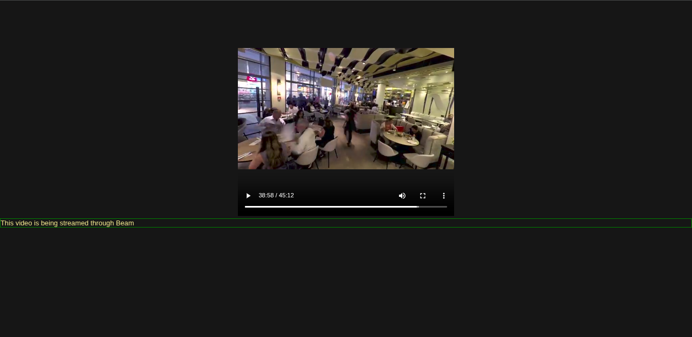

# Beam 
Do you want to share large videos with your friends without them having to download?

Welcome Beam ! 

Beam is a simple standalone python script that allows the script runner to stream a video file over the local network, allowing multiple people to view the video instantly through their browser without having to download the video in their machine. 

***
# Workings
To make this work, clone this repo and run the script `main.py` with your video file as the next parameter
```
python main.py sample.mp4
```

or if you are on linux

```
python3 main.py sample.mp4
```

After this, go to the link `<your_computer_ip>:8080` on your friend's browser. 

> To view your IP, you can use `ipconfig` on command line on windows and `ip addr` on terminal on linux



***

# Others
A sample `sample.mp4` file is provided with the source code.

Keep in mind that this is some 30 minutes thing made for the purpose of using it instantly so it just does video for now, i have tested with a 2 hour long video with 5 different browsers running simulatenously and it works without dropping a sweat

I have tested this in chrome and firefox. It used to fail on chrome but now it works on chrome too.

Something that I have noticed is that if you close the server, it is expected that the streaming will stop and your video will try to load on both of the browser and halt. If you run the server again without refreshing the browser chrome will continue playing (meaning it will continue request the server and check if it is back on or not). On the other hand, firefox will give up really quickly and video won't continue. This might be happening only on my device or my version of firefox ESR but idunno.

# License 
Copyright (c) [2026] [Meyan Adhikari]

Permission is hereby granted, free of charge, to any person obtaining a copy
of this software and associated documentation files (the "Software"), to deal
in the Software without restriction, including without limitation the rights
to use, copy, modify, merge, publish, distribute, sublicense, and/or sell
copies of the Software, and to permit persons to whom the Software is
furnished to do so, subject to the following conditions:

The above copyright notice and this permission notice shall be included in all
copies or substantial portions of the Software.

THE SOFTWARE IS PROVIDED "AS IS", WITHOUT WARRANTY OF ANY KIND, EXPRESS OR
IMPLIED, INCLUDING BUT NOT LIMITED TO THE WARRANTIES OF MERCHANTABILITY,
FITNESS FOR A PARTICULAR PURPOSE AND NONINFRINGEMENT. IN NO EVENT SHALL THE
AUTHORS OR COPYRIGHT HOLDERS BE LIABLE FOR ANY CLAIM, DAMAGES OR OTHER
LIABILITY, WHETHER IN AN ACTION OF CONTRACT, TORT OR OTHERWISE, ARISING FROM,
OUT OF OR IN CONNECTION WITH THE SOFTWARE OR THE USE OR OTHER DEALINGS IN THE
SOFTWARE.

